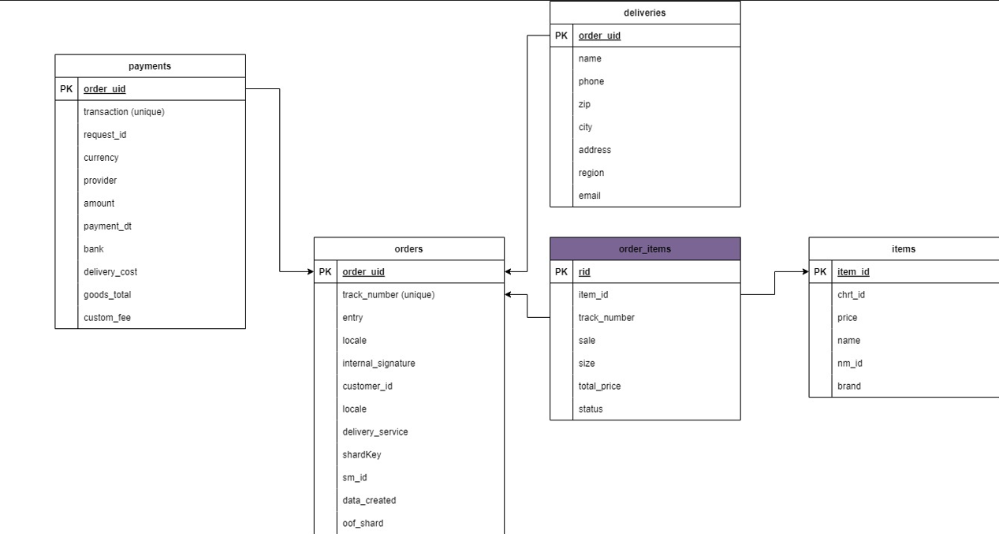

# **Задание**
Необходимо разработать демонстрационный сервис с простейшим интерфейсом, отображающий данные о заказе.

Данное задание предполагает создание небольшого микросервиса на Go с использованием базы данных и очереди сообщений. Сервис будет получать данные заказов из очереди (Kafka), сохранять их в базу данных (PostgreSQL) и кэшировать в памяти для быстрого доступа.

## Модель данных
```json
{
   "order_uid": "b563feb7b2b84b6test",
   "track_number": "WBILMTESTTRACK",
   "entry": "WBIL",
   "delivery": {
      "name": "Test Testov",
      "phone": "+9720000000",
      "zip": "2639809",
      "city": "Kiryat Mozkin",
      "address": "Ploshad Mira 15",
      "region": "Kraiot",
      "email": "test@gmail.com"
   },
   "payment": {
      "transaction": "b563feb7b2b84b6test",
      "request_id": "",
      "currency": "USD",
      "provider": "wbpay",
      "amount": 1817,
      "payment_dt": 1637907727,
      "bank": "alpha",
      "delivery_cost": 1500,
      "goods_total": 317,
      "custom_fee": 0
   },
   "items": [
      {
         "chrt_id": 9934930,
         "track_number": "WBILMTESTTRACK",
         "price": 453,
         "rid": "ab4219087a764ae0btest",
         "name": "Mascaras",
         "sale": 30,
         "size": "0",
         "total_price": 317,
         "nm_id": 2389212,
         "brand": "Vivienne Sabo",
         "status": 202
      }
   ],
   "locale": "en",
   "internal_signature": "",
   "customer_id": "test",
   "delivery_service": "meest",
   "shardkey": "9",
   "sm_id": 99,
   "date_created": "2021-11-26T06:22:19Z",
   "oof_shard": "1"
}
```

## Реализация

### ER модель базы данных


**Комментарии по таблицам**

1. **Orders**
- order_uid - первичный ключ заказа (PK)
- track_number - трек-номер для отслеживания заказа (принимаю, что каждому заказу присваивается уникальный трек-номер)
- customer_id - ID пользователя, совершившего заказ
- все остальные поля по модели...

2. **Deliveries**
- order_uid - первичный ключ заказа PK + FK, ссылающийся на значение order_uid таблицы orders
- все остальный поля по модели... 

3. **Payments**
- order_uid - первичный ключ заказа PK + FK, ссылающийся на значение order_uid таблицы orders
- transaction - уникальный номер транзакции
- все остальный поля по модели... 

4. **Items** - таблица, содержащая информацию о товарах (считаю, что сюда добавляются значения, когда новый продавец размещает свой товар, а не когда конкретный customer_id покупает его, поэтому в рамках задания эта таблица будет уже заполнена)
- item_id - PK (просто autoincrement-поле)
- chrt_id - размер товара в WB-системе
- price
- name
- nm_id - артикул товара WB (не принимаю это поле unique, тк некоторые товары разных размеров имеют 1 артикул)
- brand

5. **Order_items** - связующая таблица, которая сопоставляет Orders и Items (1 заказ может содеражть несколько позиций Items, так и каждый item_id может присутствовать в разных заказах)
- rid - уникальный номер позиции в заказе (PK)
- item_id - (FK) - ссылается на item_id таблицы items
- track_number (FK) - ссылается на уникальное поле в orders
- sale - конкретная скидка в рамках данного заказа
- size - конкретный размер в рамках данного заказа
- total_price - итоговая цена товаров item_id
- status

### Кэширование
- При запуске/перезапуске сервиса с помощью функции ```fillCache(capacity int)``` заполняю кэш последними capacity значениями (по умолчанию в config это значение = 1000)
- Далее в процессе работы применяется алгоритм LRU и последние полученные данные заказов остаются в памяти для более быстрого последующего доступа

### Канал сообщений
- при запуске сервиса инициализируется и запускается ```Producer```, которые с некоторой пеереодичностью (для личного тестирования просто установила 5сек, но можно и изменить значение) генерирует и отправляет тестовые заказы Order 
- благодаря установки парметра RequiredAcks: -1 обеспечивается точная доставка сообщения до всех реплик брокера

### Обработка получения сообщений
- при запуске сервиса инициализируется и запускается ```Consumer```, который принимает входящие заказы и следует следующему алгоритму обработки сообщений:
1. Парсинг
2. Валидация
3. Проверка дубликата (существует ли такой заказ в системе)
    если есть -> фиксируем оффсет и выходим
4. Начало транзакции
5. Сохранение в БД (сохранение во все таблицы: orders->deliveries->payments->order_items)
6. Завершение транзакции
7. Сохранение в кэш
8. Фиксация оффсета

При таком подходе при различных сбоях и падениях удастся избежать потери данных, а также их дублирования

